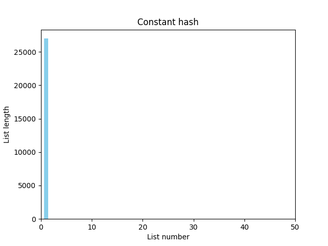
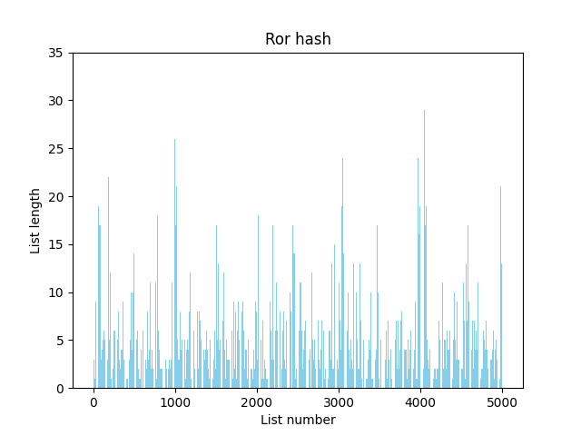
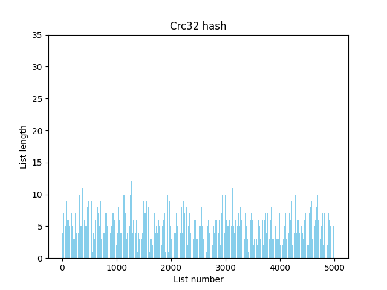

# Хэш-таблицы: сравнение различных хэш-функций, используемых для реализации хэш-таблиц и оптимизация хэш-таблицы
## Цель
Цель данной практической работы - сравнить, насколько равномерно разные хэш-функции распределяют элементы по ячейкам хэш-таблицы, а также найти "узкие" места программы, работающие долго и ускорить их работу с помощью различных оптимизаций.

## Хэш-таблица
В данной работе реализована хэш-таблица с прямой адресацией, в которой коллизии решаются методом цепочек. При такой реализации в каждой ячейке хранится указатель на список (храним именно списки для решения коллизий: ситуаций, в которых в одну и ту же ячейку хэш-таблицы попадет несколько различных элементов). Для добавления элемента в таблицу с помощью хэш-функции рассчитаем индекс ячейки, в которой он будет находиться и добавим элемент в список, хранящийся в этой ячейке, если такого элемента в списке ещё нет. 

Будем вставлять в таблицу слова из романа О. Уайльда "Портрет Дориана Грея". Для удобства дальнейшей работы текст предварительно отфильтруем следующим образом: уберём цифры, знаки препинания, заменим буквы верхнего регистра на буквы нижнего регистра и напишем каждое слово с новой строчки. В полученном тексте ≈26000 различных слов. Для исследовния хэш-таблицы "перегрузим" её, сделав load-фактор ≈5. То есть её размер сделаем ≈5000 (возьмём простое чило, близкое к 5000 - 5003). 

## Часть 1: сравнение хэш-фунций
Производительность написанной хэш-таблицы зависит от того, как хэш-функция распределяет ключи по ячейкам.
Реализуем несколько различных хэш-функций и сравним, как они насколько равномерно они распределяют элементы по ячейкам хэш-таблицы.

Рассматриваемые хэш-функции:
1. [const_hash](#const-hash) - вегда возвращает одно и то же значение;
2. [first_letter_hash](#first-letter-hash)- возвращает ASCII-код первой буквы строки;
3. [ASCII_sum_hash](#ASCII-sum-hash) - возвращает сумму ASCII-кодов букв строки; 
4. [strlen_hash](#strlen-hash) - возвращает длину строки;
5. [rol_hash](#rol-hash) - возвращает значение, полученное при помощи функции rol - битового вращения влево; 
6. [ror_hash](#rol-hash) - возвращает значение, полученное при помощи функции rol - битового вращения вправо;
7. [crc32_hash](#crc32-hash) - возвращает значение, полученное при помощи алгоритма crc32.

Сравнение распределения элементов по ячейкам хэш-таблицы производится слеующим образом:
1. Графически, с помощью построения гистограмм, в которых высота столбца, соответствующего каждой ячейке хэш-таблицы, равна количеству элементов в списке из этой ячейки
2. Количественно, с помощью подсчёта дисперсии длины списка. 

<a name="const-hash"></a>
### 1. const_hash 
Эта хэш-функция для любого аргумента возвращает 1.
```
uint32_t const_hash(const char* str) {

    return 1;

}
```
Гистограмма выглядит следующим образом:



Все столбцы, кроме одного, имеют нулевую высоту, высота оставшегося столбца равна количесту различных слов в исходном тексте.

$D = 219.75$


<a name="first-letter-hash"></a>
### 2. first_letter_hash
Данная хэш-функция возвращает ASCII-код первой буквы слова.
```
uint32_t first_letter_hash(const char* str) {

    return (uint32_t)str[0];

}
```

Полученное распределение:


В этом случае распределение лучше, чем в предыдущем, но всё равно не очень хорошее, так как всегда заполняется ограниченное колиество ячеек: от ячейки с номером 97 (ASCII-код буквы "a") до ячейки с номером 122 (ASCII-код буквы "z").

$D = 90.11$

<a name="ASCII-sum-hash"></a>
### 3. ASCII_sum_hash
Эта хэш-функция возвращает сумму ASCII-кодов всех букв в слове.
```
uint32_t ASCII_sum_hash(const char* str) {

    int str_length = strlen(str);
    uint32_t hash_sum = 0;

    for (int i = 0; i < str_length; i++) {
        hash_sum += (uint32_t)str[i];
    }

    return hash_sum;
}
```

Сначала рассмотрим эту фунцию на небольшом размере таблицы:


Распределение выглядит довольно равномерным, что подтверждает полученная дисперсия: $D = 13.46$.

Получается, это довольно хорошая хэш-функция? Попробуем Использовать её на таблице большего размера:


В приближенном масштабе:


Видим, что в полученном распределении присутствуют такие же "пики", как в случае с маленькой таблицей, однако распределение выглядит менее равномерным, а также заполнена не вся таблица. Почему же при использовании маленькой таблицы распределение выглядело более равномерным? Это происходит из-за того, что в случае маленькой таблицы мы берём хэш-сумму по модулю длины таблицы и таблица "заворачивается" так, что пики "накладываются" на участки с маленьким количеством элементов ячейки и распределение выглядит более равномерным.  

$D = 16.38$ 


<a name="strlen-hash"></a>
### 4. strlen_hash
Эта хэш-функция в качестве значения возвращает длину слова.
```
uint32_t strlen_hash(const char* str) {

    return (uint32_t)strlen(str);

}
```

Гистограмма распределения выглядит так:


В увеличенном масштабе:


Эта функция также имеет не очень хорошее распределение в силу того, что заполняются далеко не все ячейки. Известно, что самое длинное слово в англйском языке - "pneumonoultramicroscopicsilicovolcanoconiosis" - состоит из 45-ти букв, значит, ячейки с номером больше 45 не могут быть заполнены (из построенной гистограммы видно, что слова длины более 22 в нашем тексте не встречаются).

$D = 126.72$


<a name="rol-hash"></a>
### 5. rol_hash
Эта функция считает хэш строки по следующей формуле: $h(n) = rol(h(n-1)) xor str[n]$, где $rol$ - битовое вращение влево, $str[n]$ - n-ая буква строки, $h(0) = 0$. 
```
uint32_t rol_hash(const char* str) {

    uint32_t hash_sum = 0;

    size_t len = strlen(str);

    for (size_t i = 0; i < len; i++) {

        hash_sum = rol(hash_sum) ^ str[i]; 
                                                           
    }
    return hash_sum;

}
```
Для реализации этой хэш-функции была написана вспомогательная функция:
```
inline uint32_t rol(uint32_t value) {

    return ((value << 1)) | (value >> 31);

}
```
Посмотрим, как компилятор преобразовывает эту функцию в ассемблерный код.

С флагом `-O0`:


Заметим, что компилятор смог распознать инструкцию `rol`, но оставил вызов функции.

С флагом `-O3`:


В этом случае компилятор также использует ассемблерную инструкцию `rol`, но помимо этого избавился от вызова функции.

Гистограмма распределения элементов по ячейкам:


При использовании этой хэш-функции уже заполняются все ячейки таблицы, а также распрееление более равномерное.
$D = 3.52$

<a name="ror-hash"></a>
### 6. ror_hash
Эта функция аналогична предыдущей, но вместо `rol` использует функцию `ror` - битовое вращение вправо. Хэш строки считается по формуле: $h(n) = ror(h(n-1)) xor str[n]$.

```
uint32_t ror_hash(const char* str) {

    uint32_t hash_sum = 0;

    size_t len = strlen(str);

    for (size_t i = 0; i < len; i++) {

        hash_sum = ror(hash_sum) ^ str[i];
    }

    return hash_sum;

}
```

Вспомогательная функция `ror`:
```
inline uint32_t ror(uint32_t value) {

    return ((value >> 1)) | (value << 31);

}
```

Посмотрим, как она преобразуется в ассемблерный код.

С флагом `-O0`:


С `-O3`:


Аналогично предыдущему пункту, в обоих случаях компилятор распознал инструкцию `ror`, но в случае компиляции с `-O3` ещё и избавился от вызова вспомогательной функции.

Полученное распределение:



Снова получили, что заполнены все ячейки, а распределение более равномерное, чем в первых 4-х пунктах.

$D = 4.79$


<a name="crc32-hash"></a>
### 7. crc32_hash
Эта функция для подсчёта хэша использует алгоритм [crc](https://en.wikipedia.org/wiki/Cyclic_redundancy_check).

```
uint32_t crc32_hash(const char* str) {

    uint32_t crc_table[256];
	uint32_t crc = 0;
	size_t len = strlen(str);

	for (int i = 0; i < 256; i++) {
		crc = i;

		for (int j = 0; j < 8; j++)
			crc = crc & 1 ? (crc >> 1) ^ 0xEDB88320U : crc >> 1;

		crc_table[i] = crc;
	}

	crc = 0xFFFFFFFFU;

	while (len--)
        crc = crc_table[(crc ^ *str++) & 0xFF] ^ (crc >> 8);

	return crc ^ 0xFFFFFFFFU;
}
```

Гистограмма распределения элементов по ячейкам таблицы:



$D = 2.33$

Таким образом, распределение, получаемое при использовании этой хэш-функции, лучшее из всех рассмотренных.

### Вывод
Сравнив полученные значения дисперсии для разных функций, получим следующее (в талице функции идут от лучшей к худшей)

|Хэш-функция|Дисперсия|
|------------|------|
| crc32_hash | 2.33 | 
| rol_hash   | 3.52 | 
| ror_hash   | 4.79 | 
| ASCII_sum_hash (big table) | 13.46 |
| ASCII_sum_hash (small table)  | 16.38| 
| first_letter_hash | 90.11 | 
| strlen_hash | 126.72 |
| const_hash | 219.75 | 381.406586

Видно, что лучшее распределение имеет crc32_hash. Также очень хорошее распределение у rol_hash и ror_hash.
В дальнейшей работе будем использовать crc32_hash.

## Часть 2: оптимизация работы хэш-таблицы
В этой части мы попробуем оптимизировать нашу хэш-таблицу, применяя знание ассемблера и intrinsic-функций. Для этого мы считаем слова из того же файла, что и в первой части, в массив, заполним этими словами хэш-таблицу (в качестве хэш-функции возьмём crc32), а затем пройдёмся по массиву и будем находить каждое слово в таблице, причём таких "прохождений" будет 100. Будем измерять время, которое тратится именно на поиск слов в таблице.

Расчёт времени работы программы будем производить при помощи ассемблерной инструкции `rdtsc`, возвращающей количество тактов процессора, прошедших с последнего сброса. Так как для сравнения скорости работы разных версий программы мы будем находить отношение времён, за которое эти программы выполняются, в качетсве единиц измерения можно оставить тики процессора и не переводить их в секунды.

После реализации каждой оптимизации будем рассчитывать абсолютное ускорение $$a_{абс} = \frac{T_i}{T_0},$$ где $T_i$ - время работы версии с i-ой по счёту оптимизацией, $T_0$ - время работы "начальной" версии без оптимизаций, и относительное ускорение  $$a_{отн} = \frac{T_i}{T_{i-1}},$$ где $T_{i-1}$ - время работы предыдущей версии. 

В случае первой оптимизации эти значения будут совпадать.

Реализуемые оптимизации будут предполагать знание ассемблера и вставки ассемблерного кода, что значительно ухудшает "читабельность" и понимание кода. Поэтому будем рассчитывать "коэффициент полезного действия" оптимизации: 

$$K = \frac{a_{абс}}{N} · 1000,$$
где $N$ - число строк ассемблерного кода в очередной оптимизации.

Работать будем в `Visual Studio`, для выявления самых "долгих" функций воспользуемся встроенным профилировщиком. Во всех версиях используетя масимальный уровень оптимизации, доступный в `Visual Studio` - `-O2`.

### 0. Версия без оптимизаций

| Версия программы | $t_1$       | $t_2$       | $t_3$       | $t_{ср} $|
|------------------|-------------|-------------|-------------|-----------------|
| Без оптимизаций  | 105791093312 | 106414842038 | 106414842039 | (106.2 ± 3.7) · $10^9$ |

Характерное время работы программы - ≈ 45 секунд  


### 1. Оптимизация хэш-функции (использование intrinsic'ов)

С помощью профилировщика `Visual Stidio` выявим функции, на которые тратится больше всего времени


Отсюда видно, что самой времязатратной является функция хэширования `crc32_hash`. Попробуем оптимизировать её.

Вспомним, что существует intrinsic-функция `_mm_crc32_u32`, считающая хэш по тому же алгоритму `crc32` и обрабатывающая 4 байта за раз (также существует функция `_mm_crc32_u64`, обрабатывающая за раз 8 байт, но в моей работе она не рассматривается, так как далее будет использована ассемблерная вставка, которая в Visual Studio поддерживается только в 32-битной версии компилятора, поэтому для точности все запуски производятся в 32-битной системе).

Заметим, что длина слова в нашей выборке не превосходит 32 (что было видно при исследовании хэш-функции, возвращающей длину слова). Если бы всё-таки в выборке встречалиь слова длинее 32 букв, для них можно было бы использовать вторую хэш-таблицу. Но в ней было бы значительно меньше слов по сравнению с первой таблицей, так что добавление второй таблицы практически не влияло бы на производительность.

Тогда функция хэширования, переписанная с использованием intrinsic-ов и с учётом того, что входные данные уже выровнены по 32 байта, выглядит следующим образом:

```
uint32_t crc32_hash_intrinsic(const char* str) {

    uint32_t crc = 0;

    for (size_t i = 0; i < 8; ++i) {
        crc = _mm_crc32_u32(crc, *((uint32_t*)str + i));
    }

    return crc;
}
```
Полученные значения для времени:

| Версия программы | $t_1$      | $t_2$      | $t_3$      | $t_{ср} $|
|------------------|------------|------------|------------|-----------------|
| Intrinsic crc32  | 50103757115 | 54475681601 | 55523699543 | (53.4 ± 2.9) · $10^9$ |

Характерное время работы программы - ≈ 20-25 секунд

Ускорение, которое даёт эта оптимизация:

| Версия программы | $a_{абс}$       | $a_{отн}$  | 
|------------------|-----------------|------------|
| Без оптимизаций  | 1.00            | 1.00       | 
| Intrinsic crc32  | 1.98 ± 0.19     | 1.98 ± 0.19| 


### 2. Оптимизация strcmp (ассемблерная вставка)

Теперь самой времязатратной является функция поиска элемента в хэш-таблице


Посмотрим на неё поближе:


Здесь видно, что "проблемным" местом является стандартная функция `strcmp`. Займёмся её оптимизацией. Перепишем эту функцию, используя ассемблерную вставку. 

Как уже было написано ранее, длина слова не превосходит 32, а значит, для работы со словами можно использовать `ymm` регистры, потому что слова гарантировано "умещаются" в 32 байта. Попробуем загрузить сравниваемые слова в `ymm` регистры, а затем сравнить их с помощью инструкции `vptest`. Затем воспользуемся инструкцией `setnc`, устанавливающей биты, если флаг CF = 0. Таким образом, результат нашей функции будет равен 0, если строки совпадают, и отличен от 0 в противном случае.


```
inline int strcmp_asm(const char* str1, const char* str2) {
    __asm {
        push esi
        push edi
        
        mov esi, str1
        mov edi, str2

        xor eax, eax

        vmovdqu ymm0, YMMWORD PTR [esi] 
        vmovdqu ymm1, YMMWORD PTR [edi] 

        vptest     ymm0, ymm1              
        setnc      eax                      

        pop edi 
        pop esi

    }
}
```
Время работы программы

| Версия программы | $t_1$      | $t_2$      | $t_3$      | $t_{ср} $|
|------------------|------------|------------|------------|-----------------|
| Асм. вставка strcmp  | 23050980034 | 23833177790 | 22723596956 | (23.2 ± 0.5) · $10^9$ |

Характерное время работы программы - ≈ 10-15
 секунд

Ускорение, которое даёт эта оптимизация:

| Версия программы | $a_{абс}$       | $a_{отн}$  | 
|------------------|-----------------|------------|
| Без оптимизаций  | 1.00            | 1.00       | 
| Intrinsic crc32  | 1.98 ± 0.19     | 1.98 ± 0.19|
| Асм. вставка strcmp  | 4.58 ± 0.26 | 2.30 ± 0.17|

### 3. Оптимизация поиска элемента в таблице (функция на ассемблере)

Несмотря на то, что после предыдущей оптимизации программа ускорилась в 2 раза (относительно версии с первой оптимизацией), самой времязатратной всё ещё остаётся функция поиска элемента в таблице.


Код этой функции выглядит так:

```
int hashtable_find_key(HashTable* table, uint32_t hash_val, const char* value) {

    Node* key_cell = table->cells[hash_val].head;

    while (key_cell != NULL) {

        if (strcmp_asm(value, key_cell->value) == 0)
            return FOUND;

        key_cell = key_cell->next;

    }

    return NOT_FOUND;
}
```

При помощи [godbot](https://godbolt.org/) посмотрим, во что компилируется этот код с флагом `-O2`


Можно заметить, что этот код можно оптимизировать: например, слово, которое мы ищем в таблице, не меняется. Это значит, что его можно не перезаписывать в регистр `ymm0` при каждом заходе в цикл сравнения строк. Вынесем это за преелы цикла.

Полученная функция:

```
find_key_asm PROC

        mov     eax, DWORD PTR [esp-4]    ; pointer to table in eax
        mov     ecx, DWORD PTR [esp-4]    ; hash value in ecx

        push    esi
        push    edi

        mov     esi, DWORD PTR [esp+4]   ; str to find in esi (we don't have to do it
        vmovdqu ymm0, YMMWORD PTR [esi]        ;                        every time in cycle)

        mov     eax, DWORD PTR [eax]            ; pointer to table->cells in eax
        mov     ecx, DWORD PTR [eax+ecx*8]      ; table->cells[hash_val].head in ecx

        test    ecx, ecx                        ; check if table->cells[hash_val].head == NULL
        je      SHORT Not_found

Srtcmp:
        mov     eax, DWORD PTR [ecx]
        mov     DWORD PTR [esp+4], eax
        mov     edi, DWORD PTR [esp+4]          ; str in list in edi
        xor     eax, eax

        vmovdqu ymm1, YMMWORD PTR [edi]
        vptest  ymm0, ymm1                      ; compare strings

        setae   al                              ;set bit if CF == 0
        test    eax, eax

        je      SHORT Found
        mov     ecx, DWORD PTR [ecx+4]
        test    ecx, ecx

        jne     SHORT Srtcmp


Not_found:
        vzeroupper
        xor     eax, eax
        pop     edi
        pop     esi
        ret     0

Found:
        vzeroupper
        mov     eax, 1
        pop     edi
        pop     esi
        ret     0

find_key_asm ENDP
```

Попробуем заменить этой функцией предыдущую функцию поиска слова в таблице.

Время работы программы

| Версия программы | $t_1$      | $t_2$      | $t_3$      | $t_{ср} $|
|------------------|------------|------------|------------|-----------------|
| find_key на ассемблере | 20147883251 | 20780993084 | 20689748171 | (20.5 ± 0.3) · $10^9$ |

Характерное время работы программы - ≈ 10 секунд

Ускорение, которое даёт эта оптимизация:

| Версия программы | $a_{абс}$       | $a_{отн}$  | 
|------------------|-----------------|------------|
| Без оптимизаций  | 1.00            | 1.00       | 
| Intrinsic crc32  | 1.98 ± 0.19     | 1.98 ± 0.19|
| Асм. вставка strcmp  | 4.58 ± 0.26 | 2.30 ± 0.17|
| find_key на ассемблере  | 5.18 ± 0.25 | 1.13 ± 0.03|

Заметим, что в этом случае ускорение уже меньше, чем в предыдущих, а объём ассемблерного кода значительно увеличился, поэтому перейдём к сравнительному анализу реализованных оптимизаций. 

### Анализ оптимизаций

Рассчитаем для каждой оптимизации "коэффициент полезного действия", о котором уже говорилось ранее.

| Версия программы | $a_{отн}$  | $N$       | $K$  | 
|------------------|------------|-----------|-------|
| Intrinsic crc32  |1.98 ± 0.19 | 4         | 495 ± 47|
| Асм. вставка strcmp  | 2.30 ± 0.17| 11    | 209 ± 15|
| find_key на ассемблере | 1.13 ± 0.03 | 36 | 31 ± 1|

Из таблицы видим, что с увеличением количества ассемблерных строк этот коэффициент падает (хотя он также зависит от ускорения). Кроме того, для оптимизации поиска слова в таблице коэффициент значительно меньше, чем для оптимизации хэш-функции, значит, в данном случие оптимизация хэш-функции играет бóльшую роль, и для улучшения работы хэш-таблицы стоит в первую очередь использовать её, а оптимизация find_key не настолько критична.  

## Общие выводы
... производительность работы хэш-таблицы сильно зависит от используемой хэш-функции и распределения, которое она даёт. Поэтому для лучшей скорости работы хэш-таблицы важно правильно подбирать хэш-функцию.

Кроме того, существует большое количество способов ускорить хэш-таблицу вручную: например, использование intrinsic-ов, вставки ассемблерного кода и написание некоторых функций непосредственно на ассемблере. Но важно помнить, что использование кода на ассемблере значительно ухудшает восприятие кода, а также такой код может не поддерживаться другой архитектурой. Поэтому важно знать, когда стоит останоситься и держать баланс между ускорением программы и поддержанием "читабельности" и переносимости кода.
