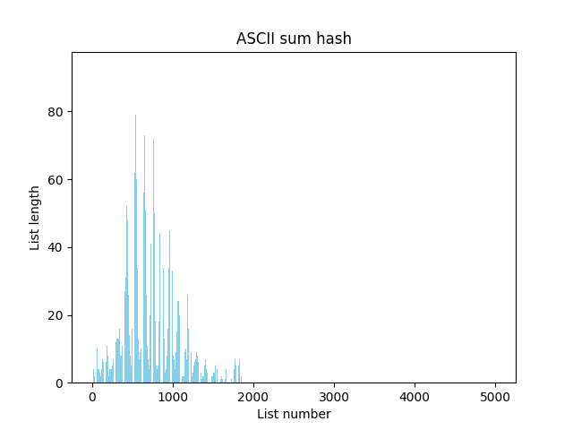

# Хэш-таблицы: сравнение различных хэш-функций, используемых для реализации хэш-таблиц и оптимизация хэш-таблицы
## Цель
Цель данной практической работы - сравнить, насколько равномерно разные хэш-функции распределяют элементы по ячейкам хэш-таблицы, а также найти "узкие" места программы, работающие долго и ускорить их работу с помощью различных оптимизаций.

## Хэш-таблица
В данной работе реализована хэш-таблица с прямой адресацией, в которой коллизии решаются методом цепочек. При такой реализации в каждой ячейке хранится указатель на список (храним именно списки для решения коллизий: ситуаций, в которых в одну и ту же ячейку хэш-таблицы попадет несколько различных элементов). Для добавления элемента в таблицу с помощью хэш-функции рассчитаем индекс ячейки, в которой он будет находиться и добавим элемент в список, хранящийся в этой ячейке, если такого элемента в списке ещё нет. 

Будем вставлять в таблицу слова из романа О. Уайльда "Портрет Дориана Грея". Для удобства дальнейшей работы текст предварительно отфильтруем следующим образом: уберём цифры, знаки препинания, заменим буквы верхнего регистра на буквы нижнего регистра и напишем каждое слово с новой строчки. В полученном тексте ≈10000 различных слов. Для исследовния хэш-таблицы "перегрузим" её, сделав load-фактор ≈5. То есть её размер сделаем ≈2000 (возьмём простое чило, близкое к 2000 - 2011). 

## Часть 1: сравнение хэш-фунций
Производительность написанной хэш-таблицы зависит от того, как хэш-функция распределяет ключи по ячейкам.
Реализуем несколько различных хэш-функций и сравним, как они насколько равномерно они распределяют элементы по ячейкам хэш-таблицы.

Рассматриваемые хэш-функции:
1. [const_hash](#const-hash) - вегда возвращает одно и то же значение;
2. [first_letter_hash](#first-letter-hash)- возвращает ASCII-код первой буквы строки;
3. [ASCII_sum_hash](#ASCII-sum-hash) - возвращает сумму ASCII-кодов букв строки; 
4. [strlen_hash](#strlen-hash) - возвращает длину строки;
5. [rol_hash](#rol-hash) - возвращает значение, полученное при помощи функции rol - битового вращения влево; 
6. [ror_hash](#rol-hash) - возвращает значение, полученное при помощи функции rol - битового вращения вправо;
7. [crc32_hash](#crc32-hash) - возвращает значение, полученное при помощи алгоритма crc32.

Сравнение распределения элементов по ячейкам хэш-таблицы производится слеующим образом:
1. Графически, с помощью построения гистограмм, в которых высота столбца, соответствующего каждой ячейке хэш-таблицы, равна количеству элементов в списке из этой ячейки
2. Количественно, с помощью подсчёта дисперсии длины списка. 

<a name="const-hash"></a>
### 1. const_hash 
Эта хэш-функция для любого аргумента возвращает 1.
```
uint32_t const_hash(const char* str) {

    return 1;

}
```
Гистограмма выглядит следующим образом:


В приближенном масштабе:


Все столбцы, кроме одного, имеют нулевую высоту, высота оставшегося столбца равна количесту различных слов в исходном тексте.

$D = 219.75$


<a name="first-letter-hash"></a>
### 2. first_letter_hash
Данная хэш-функция возвращает ASCII-код первой буквы слова.
```
uint32_t first_letter_hash(const char* str) {

    return (uint32_t)str[0];

}
```

Полученное распределение:


В этом случае распределение лучше, чем в предыдущем, но всё равно не очень хорошее, так как всегда заполняется ограниченное колиество ячеек: от ячейки с номером 97 (ASCII-код буквы "a") до ячейки с номером 122 (ASCII-код буквы "z").

$D = 52.76$

<a name="ASCII-sum-hash"></a>
### 3. ASCII_sum_hash
Эта хэш-функция возвращает сумму ASCII-кодов всех букв в слове.
```
uint32_t ASCII_sum_hash(const char* str) {

    int str_length = strlen(str);
    uint32_t hash_sum = 0;

    for (int i = 0; i < str_length; i++) {
        hash_sum += (uint32_t)str[i];
    }

    return hash_sum;
}
```

Сначала рассмотрим эту фунцию на небольшом размере таблицы:


Распределение выглядит довольно равномерным, что подтверждает полученная дисперсия: $D = 8.49$.

Получается, это довольно хорошая хэш-функция? Попробуем Использовать её на таблице большего размера:



Видим, что в полученном распределении присутствуют такие же "пики", как в случае с маленькой таблицей, однако распределение выглядит менее равномерным, а также заполнена не вся таблица. Почему же при использовании маленькой таблицы распределение выглядело более равномерным? Это происходит из-за того, что в случае маленькой таблицы мы берём хэш-сумму по модулю длины таблицы и таблица "заворачивается" так, что пики "накладываются" на участки с маленьким количеством элементов ячейки и распределение выглядит более равномерным.  

Посчитанная для большой таблицы дисперсия - $D = 8.96$ - больше, чем в случае маленькой таблицы, что подтверждает, что эта хэш-функция не так хороша, как показалось сначала.


<a name="strlen-hash"></a>
### 4. strlen_hash
Эта хэш-функция в качестве значения возвращает длину слова.
```
uint32_t strlen_hash(const char* str) {

    return (uint32_t)strlen(str);

}
```

Гистограмма распределения выглядит так:


В увеличенном масштабе:


Эта функция также имеет не очень хорошее распределение в силу того, что заполняются далеко не все ячейки. Известно, что самое длинное слово в англйском языке - "pneumonoultramicroscopicsilicovolcanoconiosis" - состоит из 45-ти букв, значит, ячейки с номером больше 45 не могут быть заполнены (из построенной гистограммы видно, что слова длины более 16 в нашем тексте не встречаются).

$D = 78.56$


<a name="rol-hash"></a>
### 5. rol_hash
Эта функция считает хэш строки по следующей формуле: $h(n) = rol(h(n-1)) xor str[n]$, где $rol$ - битовое вращение влево, $str[n]$ - n-ая буква строки, $h(0) = 0$. 
```
uint32_t rol_hash(const char* str) {

    uint32_t hash_sum = 0;

    size_t len = strlen(str);

    for (size_t i = 0; i < len; i++) {

        hash_sum = rol(hash_sum) ^ str[i]; 
                                                           
    }
    return hash_sum;

}
```
Для реализации этой хэш-функции была написана вспомогательная функция:
```
inline uint32_t rol(uint32_t value) {

    return ((value << 1)) | (value >> 31);

}
```
Посмотрим, как компилятор преобразовывает эту функцию в ассемблерный код.

С флагом `-O0`:


Заметим, что компилятор смог распознать инструкцию `rol`, но оставил вызов функции.

С флагом `-O3`:


В этом случае компилятор также использует ассемблерную инструкцию `rol`, но помимо этого избавился от вызова функции.

Гистограмма распределения элементов по ячейкам:


При использовании этой хэш-функции уже заполняются все ячейки таблицы, а также распрееление более равномерное.
$D = 3.01$

<a name="ror-hash"></a>
### 6. ror_hash
Эта функция аналогична предыдущей, но вместо `rol` использует функцию `ror` - битовое вращение вправо. Хэш строки считается по формуле: $h(n) = ror(h(n-1)) xor str[n]$.

```
uint32_t ror_hash(const char* str) {

    uint32_t hash_sum = 0;

    size_t len = strlen(str);

    for (size_t i = 0; i < len; i++) {

        hash_sum = ror(hash_sum) ^ str[i];
    }

    return hash_sum;

}
```

Вспомогательная функция `ror`:
```
inline uint32_t ror(uint32_t value) {

    return ((value >> 1)) | (value << 31);

}
```

Посмотрим, как она преобразуется в ассемблерный код.

С флагом `-O0`:


С `-O3`:


Аналогично предыдущему пункту, в обоих случаях компилятор распознал инструкцию `ror`, но в случае компиляции с `-O3` ещё и избавился от вызова вспомогательной функции.

Полученное распределение:


Снова получили, что заполнены все ячейки, а распределение более равномерное, чем в первых 4-х пунктах.

$D = 3.66$


<a name="crc32-hash"></a>
### 7. crc32_hash
Эта функция для подсчёта хэша использует алгоритм [crc](https://en.wikipedia.org/wiki/Cyclic_redundancy_check).

```
uint32_t crc32_hash(const char* str) {

    uint32_t crc_table[256];
	uint32_t crc = 0;
	size_t len = strlen(str);

	for (int i = 0; i < 256; i++) {
		crc = i;

		for (int j = 0; j < 8; j++)
			crc = crc & 1 ? (crc >> 1) ^ 0xEDB88320U : crc >> 1;

		crc_table[i] = crc;
	}

	crc = 0xFFFFFFFFU;

	while (len--)
        crc = crc_table[(crc ^ *str++) & 0xFF] ^ (crc >> 8);

	return crc ^ 0xFFFFFFFFU;
}
```

Гистограмма распределения элементов по ячейкам таблицы:


$D = 2.34$

Таким образом, распределение, получаемое при использовании этой хэш-функции, лучшее из всех рассмотренных.

### Вывод
Сравнив полученные значения дисперсии для разных функций, получим следующее (в талице функции идут от лучшей к худшей)

| crc32_hash | 2.34 |
| rol_hash   | 3.01 |
| ror_hash   | 3.66 |
| ASCII_sum_hash (small table) | 8.49 |
| ASCII_sum_hash (big table)  | 8.96 |
| first_letter_hash | 52.76 |
| strlen_hash | 78.56 |
| const_hash | 219.75 |

Видно, что лучшее распределение имеет crc32_hash. Также очень зорошее распределение у rol_hash и ror_hash.
В дальнейшей работе будем использовать crc32_hash.  